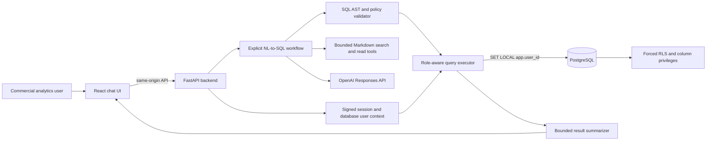
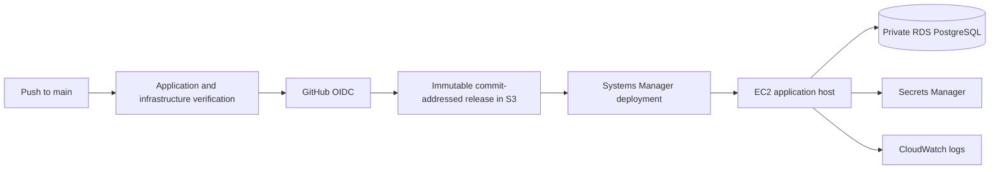

# Design

## 1. Goal and boundaries

The product is a conversational analytics assistant for a synthetic pharmaceutical
commercial dataset. A user asks a business question in plain language; the
application grounds the request in the supplied business documents, produces and
validates PostgreSQL, applies the user's database-enforced permissions, and returns
a concise business answer.

The central boundary is deliberate: the language model interprets and proposes,
but it does not authenticate users, authorize access, or execute arbitrary SQL.
Identity resolution, SQL policy, query limits, row scope, WAC access, and audit
behavior remain deterministic.

The delivered system is an evaluation/demo deployment, not a production identity,
networking, or high-availability design. It uses only synthetic data and must not
be used for PHI or other sensitive information.

## 2. Final architecture

The browser reaches an Nginx container on EC2. Nginx serves the React build and
proxies API requests to FastAPI on a private Docker network. FastAPI connects to
non-public Amazon RDS PostgreSQL through separate authentication, limited, and
executive runtime credentials. Detailed component boundaries are in
`docs/architecture.md`.

### Deployment flow

Routine releases contain tracked application source only. The two-million-row
dataset has its own versioned S3 prefix and is not regenerated or uploaded on
every code deployment.

## 3. Technology choices

### Application

- **Frontend:** React, TypeScript, and Vite; a multi-stage image serves static
  assets through Nginx and keeps browser/API traffic on one origin.
- **Backend:** Python and FastAPI for typed request/response contracts and async
  database/model operations.
- **Database access:** SQLAlchemy with PostgreSQL drivers. Generated analytics
  SQL passes through a narrow executor rather than an unrestricted ORM session.
- **SQL validation:** `sqlglot` parses an AST so policy applies to SQL structure,
  including nested expressions, instead of relying on keyword regular expressions.
- **LLM integration:** the OpenAI Responses API with Pydantic Structured Outputs.
  The configurable demo default is `gpt-5.6-sol` with `medium` reasoning. The
  model has no database credentials and no direct connection to PostgreSQL.
- **Agent orchestration:** an explicit application-owned state machine. This keeps
  planning, repair, validation, execution, and summarization boundaries visible
  without adding a general agent framework.

### Data and AWS

- PostgreSQL 16 is used locally and in Amazon RDS so SQL and security behavior
  remain aligned.
- Terraform defines EC2, RDS, S3, Secrets Manager metadata, CloudWatch logging,
  Systems Manager access, IAM, and security groups.
- One EC2 host runs the containerized frontend and backend for the demo.
- RDS is non-public and accepts PostgreSQL traffic only from the EC2 security group.
- Runtime database passwords, the signed-session secret, and the OpenAI key are
  stored in Secrets Manager. Terraform does not store their values in state.
- GitHub Actions uses short-lived OIDC credentials; no long-lived AWS access key
  is stored in GitHub.

## 4. Request flow and prompt design

1. The backend verifies the signed session, resolves the seeded user from the
   database, and derives role, region, territory, and WAC eligibility server-side.
2. The planner receives the untrusted question, a bounded recent conversation,
   the authenticated scope, and a role-safe schema.
3. The provider prefetches diverse Markdown sections and permits at most three
   additional bounded `search_domain_knowledge` or `read_domain_section` calls.
4. Planner instructions require the model to treat conversation and documents as
   data, resolve follow-ups into a standalone request, avoid invented defaults,
   and return a structured query, clarification, or denial decision.
5. A query decision must cite document/heading pairs that the provider actually
   returned. Missing or invented evidence is rejected.
6. Deterministic outcome code handles materially ambiguous geography, out-of-scope
   requests, missing market context, unknown products, no data, query timeout, and
   execution failure.
7. The SQL validator requires one read-only `SELECT`, allowed relations, columns,
   functions, and joins, named parameters for user-derived values, and a bounded
   result. The configured workflow permits one repair attempt.
8. The backend selects the limited or executive pool from the trusted user record.
9. Within one transaction, the executor sets `app.user_id` with transaction-local
   scope, applies the five-second statement timeout, and runs the validated query.
10. PostgreSQL RLS constrains rows and column grants independently protect WAC.
11. Only the bounded result and approved plan context reach the summarizer. If
    summarization fails or exceeds its shorter deadline, the application returns
    a deterministic safe fallback while retaining the tabular result.
12. The API returns business-language output and records bounded operational
    metadata. The model requests use `store=false`.

The overall agent deadline is 42 seconds, below the 55-second reverse-proxy
boundary. Provider, invalid-plan, and transient gateway failures return recoverable
application responses rather than weakening validation or database controls.

## 5. Security design

Security is defense in depth; no prompt or validator is the sole access boundary.

### Authentication and application authorization

The demo provides a selector for known seeded users. The backend creates the
signed session and reloads the identity from PostgreSQL. Client-supplied role,
region, territory, or WAC claims are not authoritative. Production would replace
the selector with SSO or another identity provider while preserving the database
authorization model.

### PostgreSQL row-level security

Forced RLS policies apply to `organizations` and `sales`:

- `exec`: global row scope;
- `director`: rows whose organization ZIP maps to the assigned region; and
- `ram`: rows whose organization ZIP maps to the assigned territory.

The runtime roles do not own protected tables and do not have `SUPERUSER` or
`BYPASSRLS`. A security-definer function materializes the current user's allowed
organization IDs as a set, and both protected tables reuse that set. This replaced
an initially correct but slow per-row lookup after full-scale security tests took
more than two minutes; the optimized suite completed in approximately 4.84 seconds.

### WAC protection

RLS protects rows, not columns. Two database privilege sets enforce the pricing
boundary:

- the limited role can query approved sales columns but cannot select `sales.wac`;
- the executive role can query the approved columns including `wac`.

The AST validator independently rejects WAC references for non-executives in
projections, filters, grouping, ordering, nested expressions, and subqueries.
Non-executive revenue requests receive a volume-based alternative without SQL
execution.

### SQL and operational controls

- exactly one parsed `SELECT`/CTE statement;
- relation, column, function, schema, and join allowlists;
- no comments, stacked statements, DDL, DML, transaction control, catalog access,
  file access, network access, `SELECT *`, or unbounded cross joins;
- named parameters for user-derived string values;
- a maximum 100-row result and five-second statement timeout;
- separate runtime pools with transaction-local user context;
- an audit event containing request ID, user, role, outcome, timing, row count,
  repair count, error code, and SQL fingerprint; and
- no raw prompt, SQL values, credentials, or result rows in the audit event.

## 6. Domain knowledge and business defaults

The eight supplied Markdown documents are both the human-readable and runtime
source of truth. At startup the backend splits them into heading-bounded sections,
computes content digests, and builds a small lexical index. Bounded tools return
exact source document and heading evidence to the planner.

A vector database was not introduced because the corpus is small, curated, and
versioned with the application. Direct Markdown retrieval avoids a second catalog
that can drift, although language interpretation still requires model-backed
evaluation.

Unless the user or bounded conversation provides a different documented choice:

- **sales/paid demand:** distributor rows for Nova-branded products;
- **revenue/dollars:** `SUM(wac)` over paid demand, executive-only;
- **equivalents:** `pack_units * unit_conversion_factor`;
- **R3M:** `mo_offset IN (0, 1, 2)`;
- **prior R3M:** `mo_offset IN (3, 4, 5)`;
- **top accounts:** grandparent level via
  `COALESCE(grandparent_org_name, org_name)`;
- **market-share numerator:** Nova distributor branded equivalents;
- **market-share denominator:** market-data equivalents in the same market
  subcategory; and
- **zero denominator:** `NULL`, not zero or an execution error.

Period offsets are used instead of ad hoc date arithmetic because they encode the
reporting calendar supplied with the assignment.

## 7. Assumptions

| Assumption | Consequence in this implementation |
| --- | --- |
| The supplied Markdown documents are authoritative for business semantics. | Plans must cite retrieved document sections; schema names alone are insufficient for metric meaning. |
| The application must work with the complete supplied scale. | Data loading, RLS, queries, indexes, and deployment were validated for 40,000 organizations and 2,000,000 sales rows. |
| The generated data is synthetic and contains no PHI. | A deliberately small demo topology is acceptable, but the public HTTP endpoint must not receive sensitive data. |
| Seeded users are acceptable evaluation identities. | The transparent user selector demonstrates scope but is not production authentication. |
| Organization access derives from organization ZIP joined to `zip_territory`. | RAM and director RLS scopes follow the supplied territory and region mapping. |
| Hub dispense is free drug and has zero WAC; paid revenue uses branded distributor data. | Free-drug volume and paid revenue remain separate metrics. |
| Reporting offsets are authoritative. | `mo_offset` and `wk_offset` predicates are preferred to calendar reconstruction. |
| The supplied generator should not be silently rewritten. | The fact that all 1,000,659 `market_data` rows are competitors and none are branded is disclosed as a synthetic-data limitation. |
| The curated document corpus is small enough for bounded lexical retrieval. | No vector service or embedding pipeline is required for the demo. |
| One EC2 instance and a small RDS instance are sufficient for evaluation traffic. | The deployment is inexpensive and understandable but not highly available. |
| No domain or trusted certificate was supplied. | The demo remains explicitly HTTP-only rather than presenting a self-signed certificate as production security. |
| External model calls can be slow or unavailable. | Timeouts, one plan-repair attempt, safe fallbacks, and deterministic security controls remain outside the model. |

## 8. Major implementation decisions

| Decision | Rationale | Trade-off and resulting implementation |
| --- | --- | --- |
| Create an independent private repository rather than fork the source assignment. | Keep the implementation history and ownership separate while retaining attribution. | The assignment checkout and generated data remain ignored; only implementation artifacts are committed. |
| Use PostgreSQL locally and in AWS. | PostgreSQL provides mature RLS, column grants, indexing, and local/cloud parity. | More setup than SQLite, but authorization is enforced at the database boundary. |
| Treat the LLM as planner/translator, never as authorization. | Prompt instructions are probabilistic and cannot guarantee access control. | Server identity, AST validation, role selection, RLS, and grants independently constrain every query. |
| Resolve identity from the signed session and database. | A client can tamper with request fields. | Role and scope fields from the browser are ignored as authority. |
| Optimize RLS with a set-based allowed-organization function. | The original per-row policy was logically correct but exceeded two minutes at full scale. | The optimized implementation adds a security-definer function but makes full-data scope practical. |
| Protect WAC with separate database roles and column grants. | RLS cannot hide an individual column. | The backend maintains limited and executive pools; the validator provides a second early rejection layer. |
| Validate SQL with `sqlglot`. | AST checks cover nested references and statement structure more reliably than regex. | The accepted SQL subset is deliberately narrow. |
| Use direct Markdown tools instead of a generated YAML catalog or vector database. | One versioned source of truth reduces drift, and the corpus is small. | Retrieval is simpler and inspectable, but model-backed quality checks remain necessary. |
| Use an explicit workflow instead of a general agent framework. | The required branching and repair behavior is small and security-sensitive. | Less framework flexibility, but control flow and failure behavior are visible in application code. |
| Keep the five-second database timeout and fix the access path. | Raising the timeout would hide an inefficient weekly plan. | Weekly performance work focused on measured plans and a reversible index. |
| Select the general weekly covering index. | It accelerated free-drug, paid-demand, equivalent, and market-data weekly shapes across all roles. | The index adds about 147 MiB; measured local weekly p95 stayed below 134 ms, and a rollback migration is included. |
| Preserve the monthly index path. | Monthly revenue, ranking, and market-share shapes were already fast and correct. | The weekly migration was verified not to change monthly results or plans materially. |
| Use the default VPC for the demo while keeping RDS private. | Avoid NAT and custom-network complexity for a disposable synthetic-data environment. | Production would require dedicated public/private subnets, controlled egress, VPC endpoints, and higher availability. |
| Use Systems Manager instead of SSH. | Reduce exposed administrative surface. | Deployment depends on SSM health and the EC2 instance role; no inbound SSH rule exists. |
| Store runtime secrets in Secrets Manager. | Keep credentials and the model key out of Git, images, workflow variables, and Terraform state values. | Secret management has a small ongoing AWS cost and requires an explicit rotation process. |
| Use GitHub OIDC and immutable releases. | Avoid long-lived CI credentials and make deployments traceable and repeatable. | Each application bundle is stored under its commit SHA and deployed through narrowly scoped S3/SSM permissions. |
| Separate full-data loading from routine CD. | Regenerating and uploading two million rows for every application commit is slow and unnecessary. | CI reuses the versioned data prefix; data changes require an explicit operational workflow. |
| Serialize deployments without cancelling active SSM work. | Cancelling GitHub does not cancel a command already running on EC2. | At most one deployment mutates the demo host, while newer work waits. |
| Keep bounded audit data instead of prompts or raw results. | Operational evidence is needed without retaining unnecessary business content. | Debugging uses request IDs, timing, error codes, fingerprints, and CloudWatch rather than raw conversations. |

## 9. Database performance decision

The original performance smoke test covered monthly analytics but missed weekly
free-drug shapes. Deployed weekly requests therefore exposed a plan that read about
100,499 `hub_dispense` rows and discarded almost all of them after week, brand, and
RLS filtering, taking roughly 23–25 seconds. One- and four-week requests scanned
essentially the same access path, so asking for a shorter period was not a valid fix.

A reversible full-data checkpoint compared:

- a general index on `(data_source, wk_offset, brand_flag, org_id)` including
  `pack_units`, `total_mg`, and `ndc`; and
- a much smaller partial free-drug index.

The general candidate was selected because every measured weekly shape benefited,
not only free drug. Across RAM, director, and executive scopes, measured local
weekly warm-cache p95 stayed below 134 ms. Monthly regression results were
identical and stayed below 177 ms p95 on their existing index. The migration uses
`CREATE INDEX CONCURRENTLY`, verifies readiness in regression checks, and includes
a concurrent rollback. Local measurements demonstrate the access-path improvement;
they are not presented as a general cloud latency guarantee.

## 10. AWS and delivery decisions

The demo uses the account's default VPC. EC2 exposes only the HTTP application
port; RDS is non-public; administration and deployment use Systems Manager; and
application/database logs go to CloudWatch without prompt or result values.

The release workflow verifies the database fixture, backend, frontend, Terraform,
release tooling, and production container builds. For a successful `main` build,
GitHub assumes a repository/branch-restricted AWS role with OIDC, uploads an
application-only archive to
`releases/app/<40-character-commit-sha>/source.tar.gz`, invokes a serialized SSM
deployment, and runs the public security and model-backed conversation gates.
The EC2 instance role—not GitHub—reads runtime secrets.

The public demo is [http://100.28.234.67](http://100.28.234.67). It is intentionally
HTTP-only and billable while EC2, RDS, the Elastic IP, S3, Secrets Manager, and
CloudWatch resources remain active.

## 11. Evaluation strategy and recorded evidence

The evaluation layers are intentionally separated:

- deterministic Markdown and SQL-policy tests that require no model;
- backend and PostgreSQL integration tests using typed injected planner outputs;
- conversation-outcome tests for ambiguity, access limits, no data, failures,
  unknown products, and business-safe language;
- frontend component, proxy, cookie, and security-header checks;
- full-data quality, RLS/WAC, and performance checks; and
- a configuration-dependent live model gate through the deployed product.

The evidence snapshot, sample SQL, expected-versus-actual results, and limitations
are consolidated in `docs/test_results.md`. The latest recorded release evidence
for application commit `5909c86` passed 65 backend tests, 6 frontend component
tests, 11/11 versioned SQL-policy cases, exact full-data validation, infrastructure
verification, immutable AWS deployment, and the model-backed conversation gate.

## 12. Trade-offs and future improvements

- A single EC2 host is appropriate for a demo but is not highly available.
- Demo user selection makes role testing easy but must be replaced by managed
  identity for production.
- Direct Markdown retrieval removes catalog drift but still needs ongoing live
  evaluation for language variation and retrieval relevance.
- The public endpoint lacks trusted TLS because no domain/certificate was supplied.
- The synthetic market-data population cannot demonstrate branded rows in that
  source and should be corrected only through a reviewed data-version change.
- The general weekly index trades approximately 147 MiB of storage and additional
  write/vacuum work for broad interactive query performance.
- Model quality, latency, and repair rate require monitoring even though database
  authorization and SQL policy do not depend on model quality.
- Terraform state is local for this demo. Production should use encrypted remote
  state with locking, protected backups, stronger deletion controls, and separate
  environments.

With more time, the next improvements would be trusted HTTPS, SSO, a load-balanced
container platform, multi-AZ database deployment, private application subnets,
controlled egress, secret rotation, remote Terraform state, richer cost/query
observability, query-cost estimation, and asynchronous evaluation pipelines.

## 13. Final state

The source repository contains the application, PostgreSQL migrations, generated-
data tooling, deterministic and integration tests, Terraform, release automation,
and operating documentation. The deployed application commit is `5909c86`. The
live URL, deployment limits, repeatable release process, rollback process, and
cost warning are documented in `docs/deployment.md`.

Implementation followed focused phases and checkpoints so architecture, security,
data, backend, agent, frontend, deployment, performance, and evaluation decisions
remain visible as separate commits.
