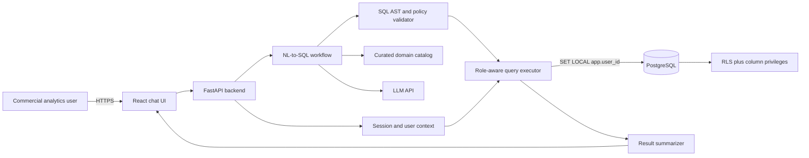

# Design

## 1. Goal

Build a conversational analytics assistant that translates pharmaceutical commercial questions into correct SQL, enforces each user's data permissions, executes only validated read-only queries, and returns a concise human-readable answer.

The design treats the language model as a planner and translator, not as a security boundary. Authorization, SQL validation, execution limits, and audit behavior remain deterministic.

## 2. Architecture

More detailed component boundaries are documented in `docs/architecture.md`.

## 3. Technology choices

### Application

- **Frontend:** React and TypeScript with Vite for a responsive chat experience and typed API contracts. A multi-stage container serves built assets through Nginx and proxies API paths to FastAPI on the same browser origin.
- **Backend:** Python and FastAPI for typed request handling, strong data/LLM library support, and straightforward async I/O.
- **Database access:** SQLAlchemy with PostgreSQL driver support. Raw generated analytics SQL is executed through a narrowly scoped executor rather than the ORM.
- **Validation:** `sqlglot` parses SQL into an AST so policy checks operate on structure, not fragile regular expressions.
- **LLM integration:** the backend calls the OpenAI Responses API and parses Pydantic Structured Outputs. `gpt-5.6-sol` with `medium` reasoning is the configurable demo default. The model produces structured plans and candidate SQL; it never receives database credentials or direct network access to PostgreSQL.
- **Agent orchestration:** a small explicit Python state machine first. A graph framework can be introduced only if branching, retries, or observability become complex enough to justify it.

### Data and infrastructure

- **Local database:** PostgreSQL in Docker Compose.
- **Cloud database:** Amazon RDS for PostgreSQL so local and cloud SQL/security behavior remain aligned.
- **Infrastructure as code:** Terraform.
- **Compute:** one EC2 instance running the containerized frontend/backend for the demo.
- **Supporting AWS services:** S3 for bulk-data staging, Secrets Manager or SSM Parameter Store for runtime configuration, and CloudWatch for application/system logs.

## 4. Request flow

1. The backend resolves the authenticated application user and loads their role and scope from the database.
2. Deterministic policy code rejects an unauthorized WAC/revenue request before SQL generation.
3. Relevant schema and business rules are selected from the role-safe domain catalog.
4. The LLM returns a structured query plan containing metric, dimensions, filters, time period, assumptions, an optional geography reference, and candidate SQL.
5. Deterministic outcome code requests clarification for materially ambiguous geography and blocks explicit out-of-scope territory/region requests. PostgreSQL remains the final authorization boundary.
6. The SQL validator parses the candidate and requires a single read-only `SELECT`, approved relations/functions, role-safe columns, bounded output, and no data-definition or data-modification operations.
7. The backend chooses the limited or executive database pool from the server-side user record.
8. Inside one transaction, the executor sets the user context with transaction-local PostgreSQL configuration and runs the validated statement with a timeout.
9. PostgreSQL RLS independently constrains visible rows. Database privileges independently protect WAC.
10. Deterministic outcome code distinguishes meaningful results, no data, timeouts, and other execution failures.
11. The result summarizer receives only a bounded meaningful result and approved assumptions. A language guard keeps implementation terminology out of the business response.
12. The backend records an audit event without storing credentials or unrestricted result data.

## 5. Security design

Security is defense in depth; no single prompt or validator is trusted to enforce access.

### Authentication and application authorization

The first version provides a demo user selector backed by known seeded users. The backend creates the session and derives the role from the database; role, region, territory, and WAC access are never accepted as authoritative request fields. A production version would replace the selector with an identity provider while preserving the same database authorization model.

### PostgreSQL row-level security

RLS policies apply to organizations and sales-derived access paths:

- `exec`: all rows
- `director`: rows whose ZIP maps to the user's assigned region
- `ram`: rows whose ZIP maps to the user's assigned territory

The executor sets `app.user_id` with transaction-local scope. Policies resolve role and assignments from the `users` table. Application roles will not own protected tables, will not receive `BYPASSRLS`, and protected tables will use `FORCE ROW LEVEL SECURITY`. At query time, a security-definer function materializes the user's allowed organization IDs as a set; both organization and sales policies reuse that set instead of performing a lookup for every fact row.

Reference tables such as products and ZIP-to-territory mappings may be readable to all application roles, but fact and organization rows remain scoped.

### WAC protection

RLS protects rows, not sensitive columns. Two database privilege sets provide the hard boundary:

- limited application role: can query approved sales columns but has no `wac` privilege
- executive application role: can query the approved columns including `wac`

The backend selects a pool only after resolving the user from the server-side session. The SQL validator also rejects any WAC reference for non-executives, including in `SELECT`, `WHERE`, `GROUP BY`, `HAVING`, `ORDER BY`, and nested expressions. Non-executive revenue questions receive a volume-based alternative.

### SQL execution controls

- exactly one parsed statement
- read-only `SELECT`/CTE queries only
- table, column, function, and schema allowlists
- no comments, stacked statements, DDL, DML, transaction control, or external-access functions
- forced result-row limit and statement timeout
- bounded result payload before summarization
- parameter binding for application-supplied values
- audit record containing user, policy outcome, SQL fingerprint, repair count, duration, row count, and outcome; raw prompts, SQL values, and result rows are omitted

## 6. Domain knowledge

The supplied Markdown documents remain the human-readable source of truth. A curated `domain_catalog.yaml` will compile the operational subset needed by the agent:

- metric formulas and required filters
- period semantics
- organization hierarchy defaults
- product and market classification rules
- synonyms
- security flags such as `requires_wac`
- provenance pointing to the source Markdown file and section

This is intentionally not an open-ended document-QA step for SQL-defining rules. A validation script will ensure source references exist, required fields are present, SQL fragments use valid schema objects, and golden examples still match. Documentation changes therefore produce a visible catalog/test failure instead of silently drifting.

No vector database is planned for the first version because the source corpus is small, curated, and security-critical. Deterministic selection from structured rules is easier to test and review.

## 7. Business defaults

Unless the user explicitly requests a different valid definition:

- **sales/paid demand:** distributor rows for Nova-branded products
- **revenue/dollars:** `SUM(wac)` over paid demand, executive-only
- **equivalents:** `pack_units * unit_conversion_factor`
- **R3M:** `mo_offset IN (0, 1, 2)`
- **prior R3M:** `mo_offset IN (3, 4, 5)`
- **top accounts:** grandparent level using `COALESCE(grandparent_org_name, org_name)`
- **market share numerator:** Nova distributor branded equivalents
- **market share denominator:** market-data equivalents in the same market subcategory
- **zero market denominator:** return `NULL`, not zero or an error

Period offsets are preferred over date arithmetic because they encode the reporting calendar supplied with the dataset.

## 8. AWS networking decision

The demo uses the account's default VPC rather than creating a production network topology. The deployed application is HTTP-only because this synthetic assignment has no domain or certificate; that limitation is explicit rather than masked with a self-signed certificate. RDS remains non-public and accepts PostgreSQL traffic only from the EC2 security group. EC2 administration and deployment use Systems Manager rather than inbound SSH. No custom private-subnet, NAT gateway, or VPC-endpoint module is included in V1.

This keeps the infrastructure understandable and inexpensive while preserving the important application-to-database boundary. The data is synthetic and contains no PHI.

For a production pharmaceutical workload, the preferred design would use dedicated public/private subnets across multiple availability zones, private RDS, VPC endpoints for AWS services, controlled egress, a load balancer/WAF, managed identity, certificate automation, key rotation, centralized audit logs, backups, and high availability.

## 9. Data assumptions and known discrepancy

- The generated data is synthetic; no real patient, prescriber, or facility data is introduced.
- The supplied generator is deterministic and its generated CSVs are build artifacts, not Git artifacts.
- Organization scope is derived by joining organization ZIP to `zip_territory`.
- Revenue uses distributor data only; hub dispense represents free drug and has zero WAC.
- The current generator appears to create `market_data` rows from competitor products only, while the business documentation describes market data as the total-market denominator. We will not silently rewrite historical source data. The domain formula follows the documentation, and data-quality tests will surface this synthetic-data limitation. Any later generator correction will be a documented, separately reviewed change.
- Ambiguous questions use documented defaults and expose the assumption in the response; materially ambiguous or unsafe questions fail closed.

## 10. Testing strategy

Testing happens locally after every meaningful phase. Cloud deployment happens at integration checkpoints rather than after every small edit.

The test pyramid includes:

- unit tests for domain-rule selection, plan schemas, and SQL policy checks
- PostgreSQL integration tests for all role/scope combinations and WAC denial
- golden NL-to-SQL cases for metrics, time periods, hierarchy, and follow-ups
- adversarial cases for prompt injection, cross-territory requests, hidden WAC references, and unsafe SQL
- full-data query/performance checks against the two-million-row dataset
- generalized conversation-quality cases for ambiguity, cross-scope requests, no data, execution failures, and business-language responses
- cloud smoke tests covering EC2, RDS, secrets, migrations, and representative conversations

## 11. Trade-offs and future improvements

- A single EC2 host is appropriate for a demo but is not highly available. Production would use a load-balanced, autoscaled container platform.
- Demo user selection is transparent for evaluation but is not production authentication.
- A curated catalog adds review work, but it provides provenance and deterministic tests for security-critical business rules.
- The first agent is an explicit workflow rather than a general-purpose agent framework, reducing hidden behavior and dependency surface.
- Full conversation memory will be bounded and represented as structured context to prevent old instructions from overriding current security rules.
- Future improvements include SSO, asynchronous evaluation pipelines, query-cost estimation, approval workflows for sensitive exports, richer observability, and automated catalog-diff review.

## 12. Delivery cadence

Each phase follows the same cadence:

`implementation -> local tests -> focused commit -> scheduled checkpoint -> cloud smoke tests -> focused fix commits`

Commits remain narrow enough that architecture, security, data, backend, agent, UI, deployment, and evaluation decisions are visible independently.
