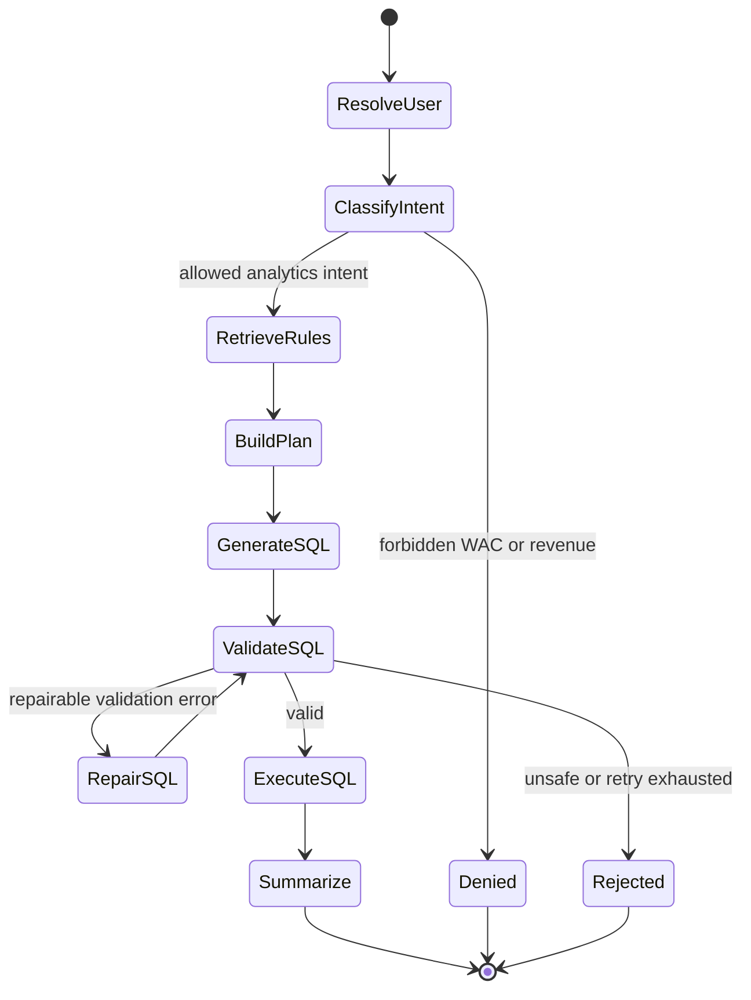
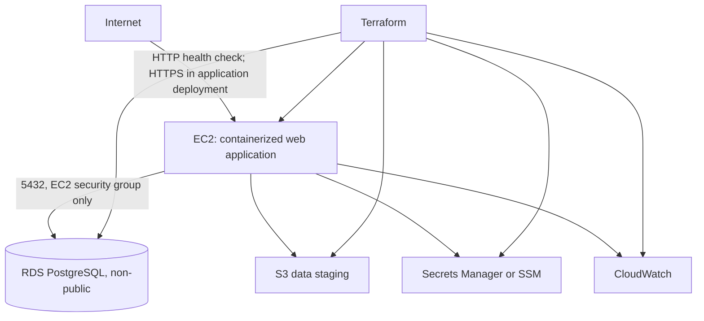

# Architecture

## Trust boundaries

```text
Browser
  |  session cookie + natural-language question
  v
FastAPI boundary
  |-- resolves user identity and server-side role
  |-- blocks unauthorized intent
  |-- selects role-safe schema/domain context
  v
LLM boundary
  |-- returns structured plan and candidate SQL
  |-- has no database credentials or network path to PostgreSQL
  v
Deterministic SQL boundary
  |-- parses AST
  |-- enforces read-only and allowlist policies
  |-- selects limited or executive connection pool
  v
PostgreSQL boundary
  |-- applies transaction-local user context
  |-- enforces RLS on rows
  |-- enforces grants on WAC
  v
Bounded rows -> summarizer -> browser
```

The browser, the natural-language input, and every LLM output are untrusted. The backend is responsible for converting those inputs into a constrained operation. PostgreSQL is the final authority for row and column access.

## Component responsibilities

| Component | Responsibility | Explicitly does not do |
|---|---|---|
| React UI | Demo login, chat input, loading state, answer/table rendering, assumption and error display | Decide access scope or execute SQL |
| FastAPI routes | Validate API shape, resolve session, invoke workflow, shape response | Trust role fields from the browser |
| User-context service | Load role/territory/region/WAC flags from PostgreSQL | Infer permissions from natural language |
| Domain service | Return the smallest relevant set of versioned business rules with provenance | Perform open-ended web or document retrieval |
| Planner | Convert a question and bounded conversation state into a typed analytics plan | Authorize the request |
| SQL generator | Produce PostgreSQL SQL from the approved plan and role-safe context | Execute SQL |
| SQL validator | Parse and enforce statement, relation, column, function, row-limit, and role rules | Replace database RLS |
| Query executor | Set transaction-local identity, select DB pool, apply timeout, return bounded rows | Repair or reinterpret SQL |
| PostgreSQL | Store analytics data and enforce row/column permissions | Decide conversational intent |
| Summarizer | Turn bounded rows and approved assumptions into a readable answer | Receive DB credentials or expand query scope |
| Audit service | Record decision/outcome metadata and timings | Store secrets or unrestricted query results |

## Agent state machine



Repairs are bounded to a small fixed count. Each repair receives validator errors but never receives broader privileges. A request that cannot be made safe returns a useful failure message.

## Planned repository layout

```text
backend/
  app/
    api/              HTTP routes and dependencies
    agent/            workflow, prompts, and typed plans
    domain/           catalog loader and rule selection
    security/         user context and policy decisions
    sql/              validator and executor
    db/               engine/session configuration
  tests/
frontend/
  src/
domain/
  domain_catalog.yaml
infra/
  terraform/
schema/
  migrations/         PostgreSQL migrations
  generated/          ignored CSV build artifacts
scripts/
docs/
```

## Database identity model

Application identity and database login identity are separate:

- The application session identifies a row in `users`.
- A narrowly scoped authentication pool can read only the approved user-context columns.
- The backend selects either the limited or executive database pool using that database-backed user record.
- The transaction sets `app.user_id` locally.
- RLS resolves scope from `users` and `zip_territory`.
- Column grants on the selected database role determine whether `wac` is even addressable.

Migrations and data loading use a separate administrative role that is never available to the request-serving process.

All three runtime login roles use `NOINHERIT` and have no direct table grants.
They can assume exactly one non-login group role: authentication, limited, or
executive. Transactions are read-only and apply a local statement timeout before
executing application SQL.

## Deployment topology



V1 uses the default VPC and does not provision a custom VPC, NAT gateway, or VPC endpoints. That trade-off is detailed in `DESIGN.md`.
